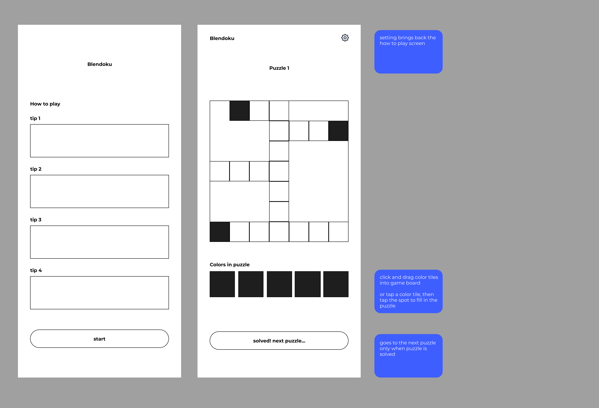

# Blendoku
Color sorting meets crossword puzzles! In this game, players are given a puzzle board of squares, like a crossword puzzle, with some colors placed in the correct spot. The player must sort through the provided color tiles and fill in the empty squares on the puzzle board in a way that creates a smooth color transition vertically and horizontally. 

Blendoku was released in 2013, but has been removed from the app store in the last year for unknown reasons. It's abscence is sincerely missed.

This game was built as the unit 1 project for General Assembly's Software Engineering Immersive.

## Wireframe

## Pseudocode
Pseudocode can be found in the root of this directory or [here](pseudocode.md).

## Credits
[Blendoku Twitter](https://twitter.com/blendoku?lang=en) 